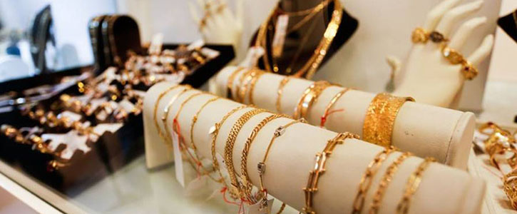
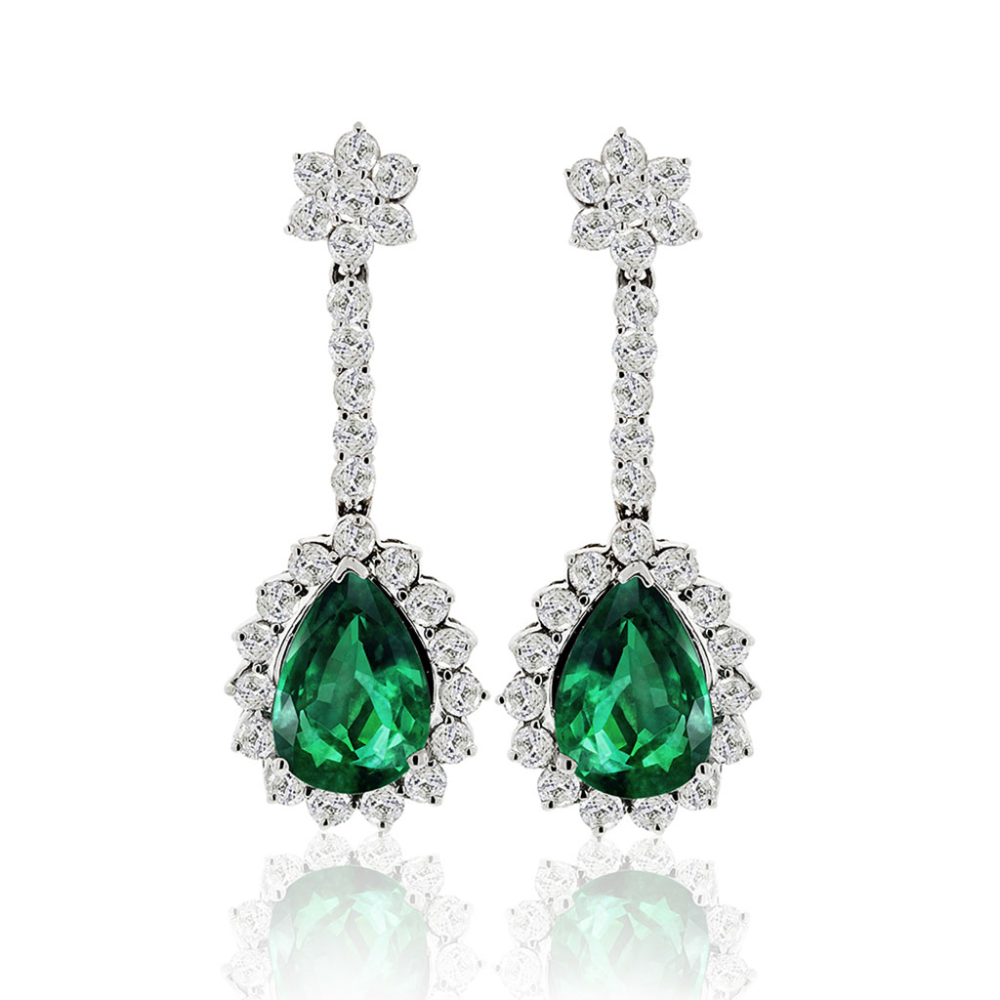
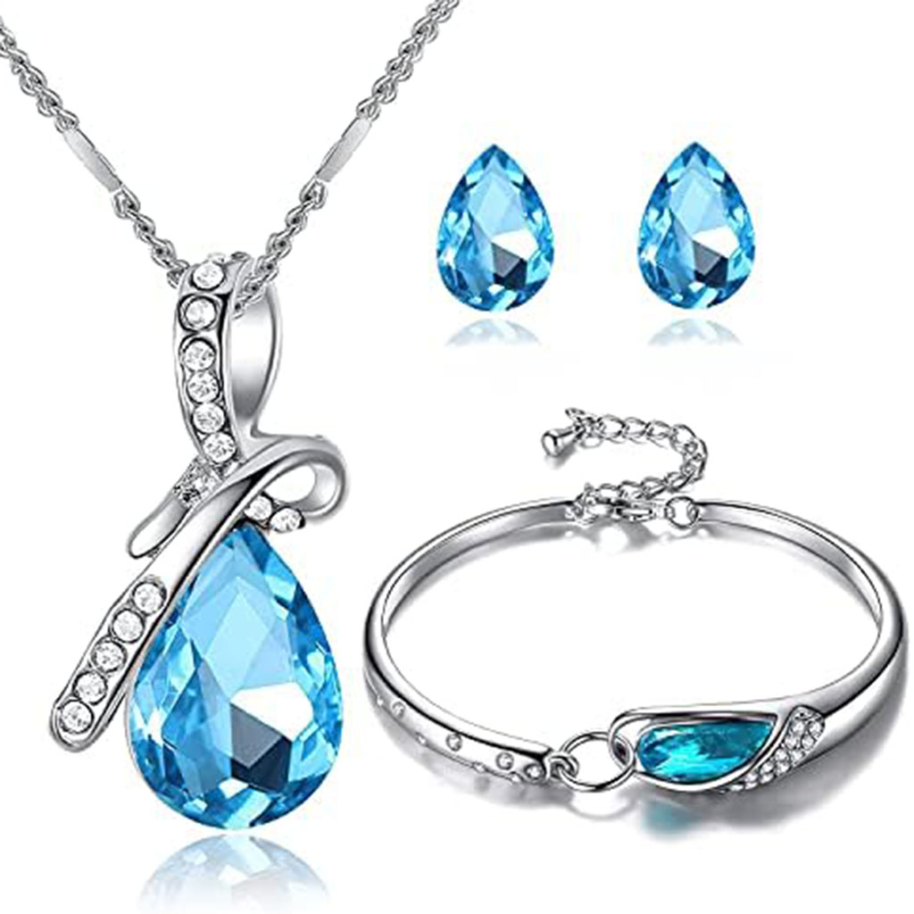
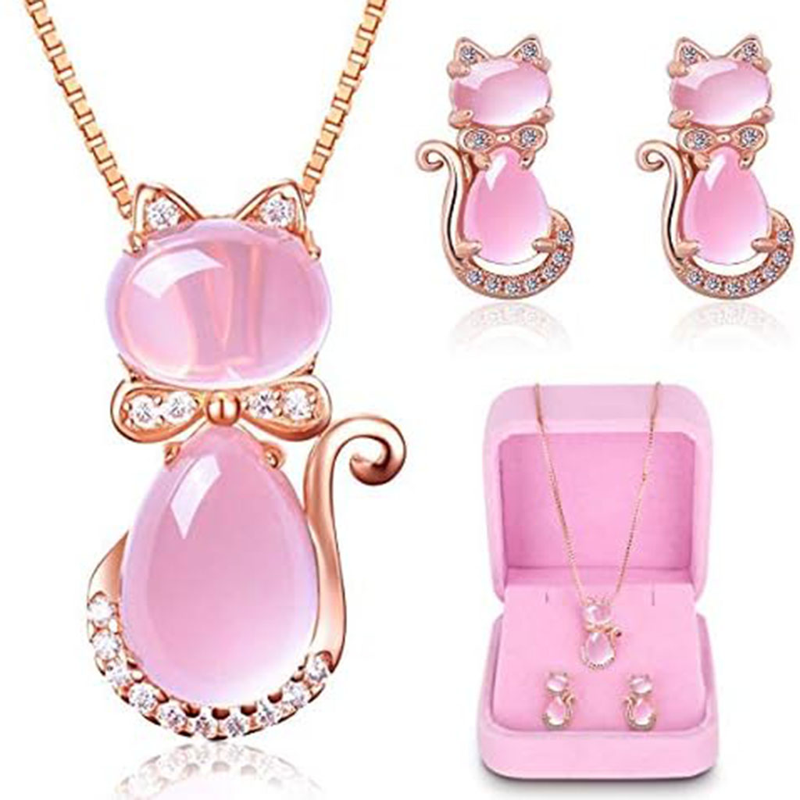
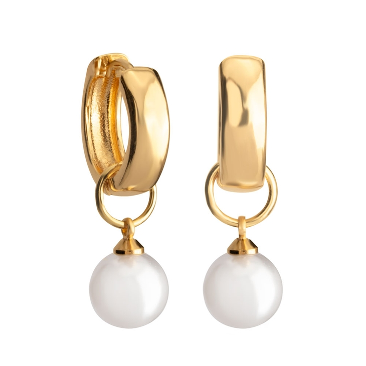
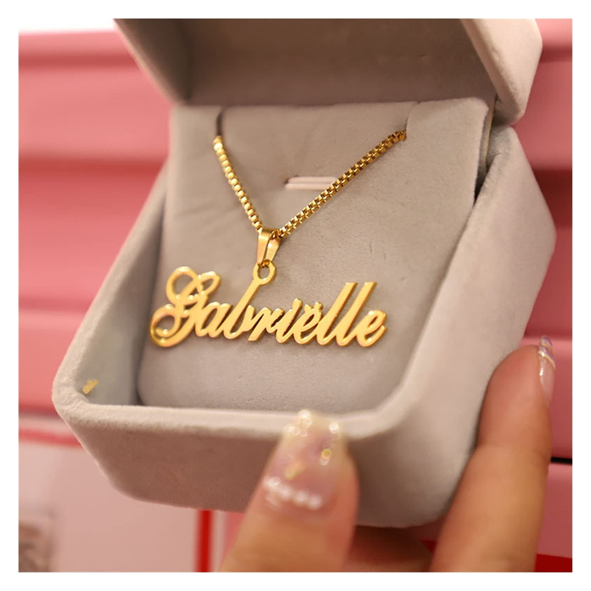
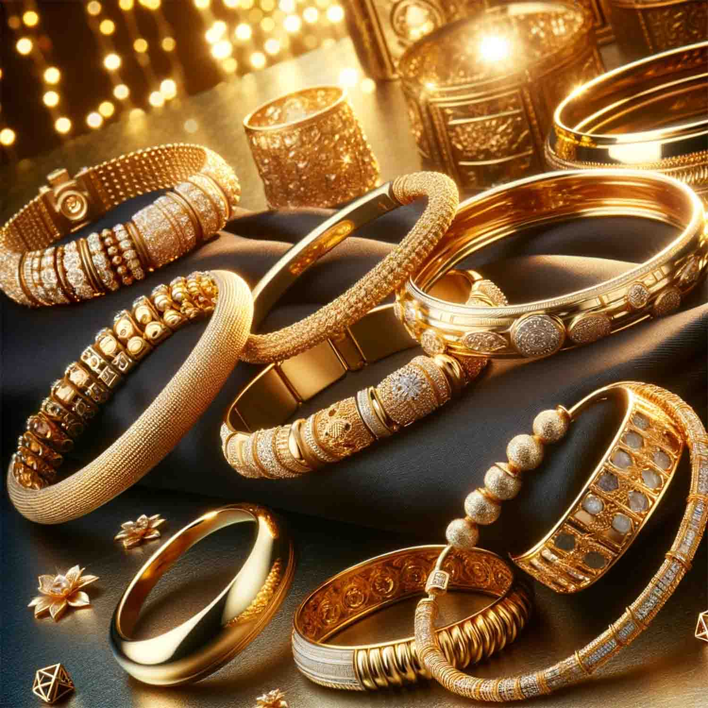

<center> <b>CARRERA:</b> INGENIERIA EN SISTEMAS COMPUTACIONALES </center>
<br/>
<center> <b>ALUMNO(S):</b> XITLALLI ALVAREZ FERNANDEZ </center>
<br/>
<center> <b>NÚMERO DE CONTROL:</b> 210110555 </center>
<br/>
<center> <b>DOCENTE:</b> ISC. PEDRO ESPINOSA ESPARZA </center>
<br/>

_LAGOS DE MORENO, JALISCO. 12/10/2024_
## Página web Joyeria

Para empezar lo que se hará será un bocetó. En este caso solo es un bocetó de la pagina principal. 


Luego se hace el wareframe en Figma, es un esquema o una guía visual que representa el esqueleto o estructura visual de un sitio web. Prácticamente la primera etapa de como se quiere ver la página, llegando a tener modificaciones ya sea en el apartado del mockup o ya al momento de programar.   


Ya por ultimo se hace el mockup, es un modelo a escala o de tamaño completo de un diseño o dispositivo, que se utiliza para la enseñanza, la demostración, la evaluación del diseño, la promoción y otros fines.


Lo primero que se ara en la programacion es poner el <"link"> para la hoja de estilo de Bootstrap. También se agregará un <"link"> para nuestra propia hoja de estilo. Se tiene también un <“script”> para que pueda acceder a ciertos mecanismos. También hay un <”div”> que sirve para darle un fondo degradado a la página. 

```html
<!DOCTYPE html>
<html lang="en">
<head>
    <meta charset="UTF-8">
    <meta name="viewport" content="width=device-width, initial-scale=1.0">
    <link href="https://cdn.jsdelivr.net/npm/bootstrap@5.3.3/dist/css/bootstrap.min.css" rel="stylesheet" integrity="sha384-QWTKZyjpPEjISv5WaRU9OFeRpok6YctnYmDr5pNlyT2bRjXh0JMhjY6hW+ALEwIH" crossorigin="anonymous">
    <link rel="stylesheet" href="style.css">
    <title>Joyeria</title>
</head>
<body>
    <div class="degradado">
    </div>

    <!------------java script-------------------->
    <script src="https://cdn.jsdelivr.net/npm/bootstrap@5.3.3/dist/js/bootstrap.bundle.min.js" integrity="sha384-YvpcrYf0tY3lHB60NNkmXc5s9fDVZLESaAA55NDzOxhy9GkcIdslK1eN7N6jIeHz" crossorigin="anonymous"></script>
</body>
</html>
```
```css
.degradado {
    background: linear-gradient(rgb(179,169,169), white);
}

```

<!----------------------------------------------------------------------------------------------->
<!----------------------------------------------------------------------------------------------->

Luego se agrega un encabezado y para esto se usará la etiqueta <"nav">, que es una sección de una página cuyo propósito es proporcionar enlaces de navegación, ya sea dentro del documento actual o a otros documentos. 
Los enlaces son para la paina principal, los productos mas vendidos, las categorías, un menú desplegable de joyas, un menú desplegable de gemas, acerca de la compañía y un buscador. 
```html
    <!--------------------Encavesado-------------------->
    <nav class="copy navbar navbar-expand-lg fixed-top">
        <div class="container-fluid">
            
            <button class="navbar-toggler" type="button" data-bs-toggle="collapse" data-bs-target="#navbarSupportedContent" aria-controls="navbarSupportedContent" aria-expanded="false" aria-label="Toggle navigation">
            <span class="navbar-toggler-icon"></span>
            </button>
            <div class="collapse navbar-collapse" id="navbarSupportedContent">
                <ul class="navbar-nav me-auto mb-2 mb-lg-0">
                    <!----------pagina principal---------->
                    <li class="nav-item">
                        <a class="nav-link active" aria-current="page" href="Joyeria.html">Home</a>
                    </li>
                    <!----------demostracion de productos---------->
                    <li class="nav-item">
                        <a class="nav-link" href="#Mas_Vendidos">Mas Vendidos</a>
                    </li>
                    <!----------busqueda por categoria---------->
                    <li class="nav-item">
                        <a class="nav-link" href="#Categoria">Categoria</a>
                    </li>
                    <!----------buscar por joyas---------->
                    <li class="nav-item dropdown">
                        <a class="nav-link dropdown-toggle" href="#" role="button" data-bs-toggle="dropdown" aria-expanded="false">
                        Joyas
                        </a>
                        <ul class="dropdown-menu">
                            <li><a class="dropdown-item" href="#">Anillos</a></li>
                            <li><a class="dropdown-item" href="#">Collares</a></li>
                            <li><a class="dropdown-item" href="#">Pulseras</a></li>
                            <li><a class="dropdown-item" href="#">tobilleras</a></li>
                            <li><a class="dropdown-item" href="#">piercings</a></li>
                            <li><a class="dropdown-item" href="#">Relojes</a></li>
                            <li><a class="dropdown-item" href="#">Pendientes</a></li>
                            <li><a class="dropdown-item" href="#">Broches</a></li>
                            <li><hr class="dropdown-divider"></li>
                            <li><a class="dropdown-item" href="#">Mas ...</a></li>
                        </ul>
                    </li>
                    <!----------buscar por gemas---------->
                    <li class="nav-item dropdown">
                        <a class="nav-link dropdown-toggle" href="#" role="button" data-bs-toggle="dropdown" aria-expanded="false">
                        Gemas
                        </a>
                        <ul class="dropdown-menu">
                            <li><a class="dropdown-item" href="#">Diamantes</a></li>
                            <li><a class="dropdown-item" href="#">Esperaldas</a></li>
                            <li><a class="dropdown-item" href="#">Tanzanitas</a></li>
                            <li><a class="dropdown-item" href="#">Zafiros</a></li>
                            <li><hr class="dropdown-divider"></li>
                            <li><a class="dropdown-item" href="#">Mas ...</a></li>
                        </ul>
                    </li>
                    <!----------acerca de---------->
                    <li class="nav-item dropdown">
                        <a class="nav-link dropdown-toggle" href="#" role="button" data-bs-toggle="dropdown" aria-expanded="false">
                        Acerca de ...
                        </a>
                        <ul class="dropdown-menu">
                            <li><a class="dropdown-item" href="acerca_nosotros.html">Nosotros</a></li>
                            <li><a class="dropdown-item" href="contacto.html">Contacto</a></li>
                        </ul>
                    </li>
                </ul>
                <!----------buscar algo en espesifico---------->
                <form class="d-flex" role="search">
                    <input class="form-control me-2" type="search" placeholder="Buscar" aria-label="Search">
                    <button style="font-weight: bold; border-width: 3px;" class="btn btn-outline-success" type="submit">Buscar</button>
                  </form>
            </div>
        </div>
    </nav>
```

Este CSS es para que el encabezado este de un color en específico, además de que el encabezado este siempre arriba sin importar que la página se mueva. . Algo a tener en cuenta es que con la etiqueta <”style”> se puede modificar el estilo de algo directamente desde el HTML. 
```css
.copy{
    background-color: rgb(255,225,147);
    font-size: 1.5rem; 
    margin: 0;
}

.fixed-top {
    position: fixed;
    top: 0;
    width: 100%;
    z-index: 1000;
}
```

<!----------------------------------------------------------------------------------------------->
<!----------------------------------------------------------------------------------------------->

Lo siguiente será una reproducción de Imágenes, donde se usará lo que se le conoce en Bootstrap como “carousel”, que es una presentación de diapositivas para recorrer una serie de contenidos, creada con transformaciones 3D CSS y un poco de JavaScript. Funciona con una serie de imágenes, texto o marcado personalizado. También incluye compatibilidad con controles e indicadores de anterior/siguiente. 

En este caso se una -id- de reproducción automática, además de tener indicadores de anterior/siguiente. Las imágenes son representante de la pagina y tienen un texto que los describe. 
```html
    <!--------------------Reproduccion de Imajenes-------------------->
    <div class="reproduccion_imagenes">
        <div id="carouselExampleAutoplaying" class="carousel slide" data-bs-ride="carousel">
            <div class="carousel-inner">
            <div class="carousel-item active">
                
                <div class="carousel-caption d-block">
                <h1 class="text-center" style="text-shadow: 2px 2px 4px rgba(0, 0, 0, 1);">Joyeria Estellar</h1><br>
                <p class="texto">Encuentra los mejores productos en nuestra tienda</p>
                </div>
            </div>
        
            <div class="carousel-item">
                
                <div class="carousel-caption d-block">
                <p class="texto">Con las mejores joyas que puedes encontrar</p>
                </div>
            </div>
        
            <div class="carousel-item">
                
                <div class="carousel-caption d-block">
                <p class="texto">Con los mejoes cortes de gemas que puedes encontrar</p>
                </div>
            </div>
            </div>
            <button class="carousel-control-prev" type="button" data-bs-target="#carouselExampleAutoplaying" data-bs-slide="prev">
            <span class="carousel-control-prev-icon" aria-hidden="true"></span>
            <span class="visually-hidden">Previous</span> 
            </button>
            <button class="carousel-control-next" type="button" data-bs-target="#carouselExampleAutoplaying" data-bs-slide="next">
            <span class="carousel-control-next-icon" aria-hidden="true"></span>
            <span class="visually-hidden">Next</span>
            </button>
        </div>
    </div>
```

En los estilos CSS se tiene modificaciones generales para el texto o la imagen. Mientras que los “@media” sirve para cuando la pantalla sea más pequeña, tanto el texto como la imagen se hagan mas pequeña. 
```css
/*--------------------Reproduccion de Imajenes--------------------*/
/* Estilos generales*/
.texto{
    font-size: 2rem;
    font-weight: bold; 
    color: white; 
    text-shadow: 2px 2px 4px rgba(0, 0, 0, 1);
}

.reproduccion_imagenes .carousel-inner img {
    width: 100%;
    height: auto;
}

.reproduccion_imagenes h1 {
    font-size: 3rem;
    text-shadow: 2px 2px 4px rgba(0, 0, 0, 1);
}

.reproduccion_imagenes .texto {
    font-size: 1.5rem;
}

/* Media Query para pantallas más pequeñas */
@media (max-width: 768px) {
    .reproduccion_imagenes h1 {
        font-size: 2rem;
    }

    .reproduccion_imagenes .texto {
        font-size: 1rem;
    }

    .reproduccion_imagenes .carousel-inner img {
        width: 100%;
        height: auto;
    }
}

/* Media Query para pantallas muy pequeñas*/
@media (max-width: 576px) {
    .reproduccion_imagenes h1 {
        font-size: 1.5rem; 
    }

    .reproduccion_imagenes .texto {
        font-size: 0.875rem; 
    }

    .reproduccion_imagenes .carousel-inner img {
        width: 100%;
        height: auto;
    }
}
```

<!----------------------------------------------------------------------------------------------->
<!----------------------------------------------------------------------------------------------->

Lo siguiente sería el apartado de mas vendidos, donde se usará un sistema de rejilla “Grid”, esto quiere decir que una fila estará dividida por dos columnas. La primera columna lo que tendrá es un texto, mientras que la segunda mostrara un “carousel” que envés de imágenes son 3 “card” mostrando el producto, nombre y precio. Esto esta acomodada de forma de que muestre tres cartas de forma vertical y a ir a otra diapositiva muestre otras tres cartas. 
```html
    <!--------------------Mas Vendidos-------------------->
    <div id="Mas_Vendidos" class="mas_vendidos">
        <div class="container my-5">
            <div class="row">
                <!-- ---------- Diálogo (Izquierda) ------------>
                <div class="col-md-4">
                    <h2 class="text-center">Mas Vendidos</h2><br>
                    <p style="font-size: 1.2rem;">Conoce nuestros productos más buscados y más vendidos.</p>
                </div>
                <div class="col-md-1">

                </div>
                <!-- ---------- Carrusel (Derecha) ---------- -->
                <div class="col-md-7">
                    <div id="carouselExampleDark" class="carousel carousel-dark slide">
                        <!---------- Indicadores del carrusel---------->
                        <div class="carousel-indicators">
                            <button type="button" data-bs-target="#carouselExampleDark" data-bs-slide-to="0" class="active" aria-current="true" aria-label="Slide 1"></button>
                            <button type="button" data-bs-target="#carouselExampleDark" data-bs-slide-to="1" aria-label="Slide 2"></button>
                            <button type="button" data-bs-target="#carouselExampleDark" data-bs-slide-to="2" aria-label="Slide 3"></button>
                        </div>
                        <!---------- Contenedor de los elementos del carrusel ---------->
                        <div class="carousel-inner">
                            <!---------- Primera Diapositiva ---------->
                            <div class="carousel-item active">
                                <div class="d-flex justify-content-center">
                                    <!-- Tarjeta 1 -->
                                    <div class="card me-3" style="width: 18rem;">
                                        
                                        <div class="card-body">
                                            <p class="card-text">
                                                $1,400
                                            </p>
                                            <p class="card-text">
                                                Aretes colgantes con esmeraldas
                                            </p><br>
                                            <a href="#" class="card-link">Mas Informacion...</a>
                                        </div>
                                    </div>
                                    <!-- Tarjeta 2 -->
                                    <div class="card me-3" style="width: 18rem;">
                                        
                                        <div class="card-body">
                                            <p class="card-text">
                                                $400
                                            </p>
                                            <p class="card-text">
                                                Dije de plata delfines encontrados
                                            </p><br>
                                            <a href="#" class="card-link">Mas Informacion...</a>
                                        </div>
                                    </div>
                                    <!-- Tarjeta 3 -->
                                    <div class="card" style="width: 18rem;">
                                        
                                        <div class="card-body">
                                            <p class="card-text">
                                                $300
                                            </p>
                                            <p class="card-text">
                                                Pulsera con diamantes de imitacion
                                            </p>
                                            <a href="#" class="card-link">Mas Informacion...</a>
                                        </div>
                                    </div>
                                </div>
                            </div>
                            <!---------- Segunda Diapositiva ---------->
                            <div class="carousel-item">
                                <div class="d-flex justify-content-center">
                                    <!-- Tarjeta 1 -->
                                    <div class="card me-3" style="width: 18rem;">
                                        
                                        <div class="card-body">
                                            <p class="card-text">
                                                $500
                                            </p>
                                            <p class="card-text">
                                                Collar con dije de corazon
                                            </p><br>
                                            <a href="#" class="card-link">Mas Informacion...</a>
                                        </div>
                                    </div>
                                    <!-- Tarjeta 2 -->
                                    <div class="card me-3" style="width: 18rem;">
                                        
                                        <div class="card-body">
                                            <p class="card-text">
                                                $700
                                            </p>
                                            <p class="card-text">
                                                Conjunto de joyeria con aretes, collar y pulsera
                                            </p>
                                            <a href="#" class="card-link">Mas Informacion...</a>
                                        </div>
                                    </div>
                                    <!-- Tarjeta 3 -->
                                    <div class="card" style="width: 18rem;">
                                        
                                        <div class="card-body">
                                            <p class="card-text">
                                                $500
                                            </p>
                                            <p class="card-text">
                                                Pulsera con dijes de la suerte plata
                                            </p><br>
                                            <a href="#" class="card-link">Mas Informacion...</a>
                                        </div>
                                    </div>
                                </div>
                            </div>
                            <!---------- Tercera Diapositiva ---------->
                            <div class="carousel-item">
                                <div class="d-flex justify-content-center">
                                    <!-- Tarjeta 1 -->
                                    <div class="card me-3" style="width: 18rem;">
                                        
                                        <div class="card-body">
                                            <p class="card-text">
                                                $1,000
                                            </p>
                                            <p class="card-text">
                                                Aretes de tortuga verde plata
                                            </p><br>
                                            <a href="#" class="card-link">Mas Informacion...</a>
                                        </div>
                                    </div>
                                    <!-- Tarjeta 2 -->
                                    <div class="card me-3" style="width: 18rem;">
                                        
                                        <div class="card-body">
                                            <p class="card-text">
                                                $35,000
                                            </p>
                                            <p class="card-text">
                                                Aretes pendientes oro 18% con forma de rosa 
                                            </p>
                                            <a href="#" class="card-link">Mas Informacion...</a>
                                        </div>
                                    </div>
                                    <!-- Tarjeta 3 -->
                                    <div class="card" style="width: 18rem;">
                                        
                                        <div class="card-body">
                                            <p class="card-text">
                                                $500
                                            </p>
                                            <p class="card-text">
                                                Conjunto de cristal con aretes y collar
                                            </p><br>
                                            <a href="#" class="card-link">Mas Informacion...</a>
                                        </div>
                                    </div>
                                </div>
                            </div>
                        </div>
                        <!---------- Controles del carrusel ---------->
                        <button class="carousel-control-prev ccp" type="button" data-bs-target="#carouselExampleDark" data-bs-slide="prev">
                            <span class="carousel-control-prev-icon" aria-hidden="true"></span>
                            <span class="visually-hidden">Previous</span>
                        </button>
                        <button class="carousel-control-next ccn" type="button" data-bs-target="#carouselExampleDark" data-bs-slide="next">
                            <span class="carousel-control-next-icon" aria-hidden="true"></span>
                            <span class="visually-hidden">Next</span>
                        </button>
                    </div>
                </div>
            </div>
        </div>
    </div>
```

Las clases de estilos generales para el apartado “mas vendidos” sirven para que los controladores e indicadores no estén directamente sobre las cartas, sino de forma que pareciera que están por fuera. El primer “@media” hace que al momento de que la pantalla se haga más pequeña el carrusel se pondrá abajo del texto; si se vuelve mas pequeña, entonces el segundo “@media” lo que ara es que las cartas ahora estén acomodadas de forma horizontalmente. 
```css
/*--------------------Mas Vendidos--------------------*/
/* Estilos generales */
.card {
    margin: 10px;
}

.ccp {
    width: 5%;
    left: -5%; /* Mueve el botón de 'anterior' a la izquierda */
}

.ccn {
    width: 5%;
    right: -5%; /* Mueve el botón de 'siguiente' a la derecha */
}

.carousel-inner {
    display: flex;
    align-items: center; /* Centrar las cartas verticalmente */
}

.carousel-indicators {
    margin-bottom: -17.5px; /* Agregar espacio entre el carrusel y los indicadores */
}

.col-md-4 {
    display: flex;
    flex-direction: column; 
    justify-content: center; 
    align-items: center; 
    text-align: center;
}

@media (max-width: 768px) {
    .mas_vendidos .text-column {
        order: 1;
    }
    .mas_vendidos .carousel-column {
        order: 2;
    }
}

@media (max-width: 576px) {
    /* Cambiar la dirección del flex a columna para las tarjetas del carrusel */
    .mas_vendidos .carousel-inner .d-flex {
        flex-direction: column;
        align-items: center;
    }

    /* Ajustar el ancho de las tarjetas para que ocupen el 100% */
    .mas_vendidos .carousel-inner .card {
        width: 100% !important;
        max-width: 300px; /* Opcional: limitar el ancho máximo */
        margin-bottom: 1rem; /* Espacio entre tarjetas */
    }

    /* Opcional: Centrar el texto */
    .mas_vendidos .text-center {
        text-align: center !important;
    }
}
```

<!----------------------------------------------------------------------------------------------->
<!----------------------------------------------------------------------------------------------->

Lo siguiente serían las categorías, donde se volverá a usar el sistema de rejillas “Grid”, en este caso abra dos filas con cuatro columnas cada uno. En sí, cada columna estará conformada por una carta, que tiene una imagen y un link. Lo que sería la última columna solo tendrá un link. 
```html
    <!--------------------Categoria-------------------->
    <div id="Categoria" class="categoria">
        <div class="container mt-4">
            <h2 class="text-center">Categoria</h2>
            <div class="row row-cols-2 row-cols-md-4 g-4 text-center mt-4">
                
            <div class="col">
                <div class="card category-card c-c">
                    
                    <div class="overlay"></div> <!-- Overlay sobre la imagen -->
                    <a href="#" class="card-link">Anillos</a>
                </div>
            </div>
        
            <div class="col">
                <div class="card category-card c-c">
                
                <div class="overlay"></div> <!-- Overlay sobre la imagen -->
                <a href="#" class="card-link">Aretes</a>
                </div>
            </div>
        
            <div class="col">
                <div class="card category-card c-c">
                
                <div class="overlay"></div> <!-- Overlay sobre la imagen -->
                <a href="#" class="card-link">Dijes</a>
                </div>
            </div>
        
            <div class="col">
                <div class="card category-card c-c">
                
                <div class="overlay"></div> <!-- Overlay sobre la imagen -->
                <a href="#" class="card-link">Joyería Personalizada</a>
                </div>
            </div>
        
            <div class="col">
                <div class="card category-card c-c">
                
                <div class="overlay"></div> <!-- Overlay sobre la imagen -->
                <a href="#" class="card-link">Pulseras</a>
                </div>
            </div>
        
            <div class="col">
                <div class="card category-card c-c">
                
                <div class="overlay"></div> <!-- Overlay sobre la imagen -->
                <a href="#" class="card-link">Collares</a>
                </div>
            </div>
        
            <div class="col">
                <div class="card category-card c-c">
                
                <div class="overlay"></div> <!-- Overlay sobre la imagen -->
                <a href="#" class="card-link">Relojes</a>
                </div>
            </div>
        
            <div class="col mas">
                <div class="card category-card">
                    <a href="#" class="card-link link">Mas...</a>
                </div>
            </div>
        
            </div>
        </div>
    </div>
```

Los estilos generales lo que hacen es alinear tanto el texto como la imagen, también modifica lo que es el enlace para que este mas personalizado. También se pone una clase para que la imagen este mas oscura y se pueda ver el texto. Los “@media” sirven para que cuando se haga mas pequeño las imágenes se acomoden de dos en dos, y mientras mas pequeño, se acomodaran de uno en uno. 
```css
/*--------------------Categoría--------------------*/
/* Estilos generales para las tarjetas */
.c-c {
    text-align: center;
    border: none;
    position: relative;
    overflow: hidden;
}

.c-c img {
    width: 100%;
    height: auto;
    object-fit: cover;
}

/* Estilos para el enlace sobre la imagen */
.c-c a {
    position: absolute;
    top: 50%;
    left: 50%;
    transform: translate(-50%, -50%);
    color: white;
    font-size: 1.5rem;
    font-weight: bold;
    text-decoration: none;
}

/* Overlay para las imágenes dentro de la clase categoria */
.categoria .c-c .overlay {
    position: absolute;
    top: 0;
    left: 0;
    width: 100%;
    height: 100%;
    background-color: rgba(0, 0, 0, 0.5);
}

/* Estilos para la clase 'mas' */
.mas {
    display: flex;
    justify-content: center;
    align-items: center;
    text-align: center;
}

.link {
    position: absolute;
    top: 50%;
    left: 50%;
    transform: translate(-50%, -50%);
    color: black;
    font-size: 1.5rem;
    font-weight: bold;
    text-decoration: none;
}

@media (max-width: 768px) {
    .categoria .row {
        grid-template-columns: repeat(2, 1fr); /* Dos columnas por fila */
    }

    .categoria .col {
        flex: 0 0 50%; /* Cada tarjeta ocupa el 50% del ancho */
        max-width: 50%;
    }
}

@media (max-width: 576px) {
    .categoria .row {
        grid-template-columns: repeat(1, 1fr); /* Una columna por fila */
    }

    .categoria .col {
        flex: 0 0 100%; /* Cada tarjeta ocupa el 100% del ancho */
        max-width: 100%;
    }
}
```

<!----------------------------------------------------------------------------------------------->
<!----------------------------------------------------------------------------------------------->

Lo que sigue será el apartado se preguntas frecuentes. Aquí se usará lo que es un “accordion”, donde tendrá tres botones que al presionarlos despliegue un texto. Los estilos que se utilizaron están en el mismo HTML y son mayormente modificaciones en el tamaño y estilo de la fuente del texto. 
```html
    <!--------------------Pregutas Frecuentes-------------------->
    <div>
        <h2 class="text-center">Pregutas Frecuentes</h2>
        <div class="accordion accordion-flush" id="accordionFlushExample">
            <div class="accordion-item">
                <h2 class="accordion-header">
                    <button style="font-weight: bold;" class="accordion-button collapsed" type="button" data-bs-toggle="collapse" data-bs-target="#flush-collapseOne" aria-expanded="false" aria-controls="flush-collapseOne">
                        Política de devolución
                    </button>
                </h2>
                <div id="flush-collapseOne" class="accordion-collapse collapse" data-bs-parent="#accordionFlushExample">
                    <div class="accordion-body">
                        Para proceder al cambio solicitado las piezas deben devolverse en un estado nuevo y sin usar, en perfectas condiciones, así como con el empaque original y ticket de compra.
                    </div>
                </div>
            </div>
            <div class="accordion-item">
                <h2 class="accordion-header">
                    <button style="font-weight: bold;" class="accordion-button collapsed" type="button" data-bs-toggle="collapse" data-bs-target="#flush-collapseTwo" aria-expanded="false" aria-controls="flush-collapseTwo">
                        ¿Con cuáles certificaciones cuentan?
                    </button>
                </h2>
                <div id="flush-collapseTwo" class="accordion-collapse collapse" data-bs-parent="#accordionFlushExample">
                    <div class="accordion-body">
                        <p>Applied jewelry professional course by GIA</p>
                        <p>Discover the gemstones by École des Arts Joailliers</p>
                        <p>Amulets & precious symbols by École des Arts Joailliers</p>
                        <p>Having access to van cleef & arpels creations by École des Arts Joailliers</p>
                    </div>
                </div>
            </div>
            <div class="accordion-item">
                <h2 class="accordion-header">
                    <button style="font-weight: bold;" class="accordion-button collapsed" type="button" data-bs-toggle="collapse" data-bs-target="#flush-collapseThree" aria-expanded="false" aria-controls="flush-collapseThree">
                        ¿Cuáles son sus tiempos de entrega?
                    </button>
                </h2>
                <div id="flush-collapseThree" class="accordion-collapse collapse" data-bs-parent="#accordionFlushExample">
                    <div class="accordion-body">
                        Si el articulo no esta en stock permítenos de 2-3 semanas para su entrega. Para confirmar los plazos de entrega de un artículo en particular, comuníquese con nuestro equipo de atención al cliente a ventas@estellar.mx
                    </div>
                </div>
            </div>
        </div>
    </div>
```

<!----------------------------------------------------------------------------------------------->
<!----------------------------------------------------------------------------------------------->

Lo último será el apartado de final donde se tiene los derechos de actor y las cuentas, en si se ordenaran de forma que los iconos estén del lado izquierdo y el texto del lado derecho. 
```html
    <!--------------------Copyright-------------------->
    <div class="copyright">
        <footer class="copy d-flex justify-content-between align-items-center p-3 footer-section">
            <!-- Íconos alineados a la derecha -->
            <div class="footer-icons">
              <svg xmlns="http://www.w3.org/2000/svg" class="icon icon-tabler icon-tabler-brand-instagram" width="44" height="44" viewBox="0 0 24 24" stroke-width="1.5" stroke="#2c3e50" fill="none" stroke-linecap="round" stroke-linejoin="round">
                <path stroke="none" d="M0 0h24v24H0z" fill="none"/>
                <path d="M4 4m0 4a4 4 0 0 1 4 -4h8a4 4 0 0 1 4 4v8a4 4 0 0 1 -4 4h-8a4 4 0 0 1 -4 -4z" />
                <path d="M12 12m-3 0a3 3 0 1 0 6 0a3 3 0 1 0 -6 0" />
                <path d="M16.5 7.5l0 .01" />
              </svg>
          
              <svg xmlns="http://www.w3.org/2000/svg" class="icon icon-tabler icon-tabler-brand-facebook" width="44" height="44" viewBox="0 0 24 24" stroke-width="1.5" stroke="#2c3e50" fill="none" stroke-linecap="round" stroke-linejoin="round">
                <path stroke="none" d="M0 0h24v24H0z" fill="none"/>
                <path d="M7 10v4h3v7h4v-7h3l1 -4h-4v-2a1 1 0 0 1 1 -1h3v-4h-3a5 5 0 0 0 -5 5v2h-3" />
              </svg>
            </div>
            <!-- Texto alineado a la izquierda -->
            <p class="footer-text">© Todos los derechos reservados a Joyeria Estellar 2024.</p>
        </footer>
    </div>

```

El estilo que tendrá es para que estén organizados por filas y el “@media” es para que cuando la pantalla sea mas pequeña el texto se ponga arriba de los iconos. 
```css
/* -------------------- Copyright -------------------- */
/* Estilos por defecto */
.copyright .footer-section {
    flex-direction: row;
}

@media (max-width: 768px) {
    .copyright .footer-section {
        flex-direction: column;
        text-align: center;
    }

    .copyright .footer-icons {
        margin-bottom: 10px;
    }

    .copyright .footer-text {
        order: -1; 
    }
}
```

<!----------------------------------------------------------------------------------------------->
<!----------------------------------------------------------------------------------------------->

Lo siguiente es crear unos nuevos archivos para los apartados de “acerca de nosotros” y “contacto”. En sí, el encabezado y el final serán lo mismo, lo que cambia será el entremedio. 
```html
<!DOCTYPE html>
<html lang="en">
<head>
    <meta charset="UTF-8">
    <meta name="viewport" content="width=device-width, initial-scale=1.0">
    <link href="https://cdn.jsdelivr.net/npm/bootstrap@5.3.3/dist/css/bootstrap.min.css" rel="stylesheet" integrity="sha384-QWTKZyjpPEjISv5WaRU9OFeRpok6YctnYmDr5pNlyT2bRjXh0JMhjY6hW+ALEwIH" crossorigin="anonymous">
    <link rel="stylesheet" href="style.css">
    <title>Joyeria</title>
</head>
<body>
    <!--------------------Encavesado-------------------->
    <nav class="copy navbar navbar-expand-lg">
        <div class="container-fluid">
            
            <button class="navbar-toggler" type="button" data-bs-toggle="collapse" data-bs-target="#navbarSupportedContent" aria-controls="navbarSupportedContent" aria-expanded="false" aria-label="Toggle navigation">
            <span class="navbar-toggler-icon"></span>
            </button>
            <div class="collapse navbar-collapse" id="navbarSupportedContent">
                <ul class="navbar-nav me-auto mb-2 mb-lg-0">
                    <!----------pagina principal---------->
                    <li class="nav-item">
                        <a class="nav-link active" aria-current="page" href="Joyeria.html">Home</a>
                    </li>
                    <!----------demostracion de productos---------->
                    <li class="nav-item">
                        <a class="nav-link" href="#">Mas Vendidos</a>
                    </li>
                    <!----------busqueda por categoria---------->
                    <li class="nav-item">
                        <a class="nav-link" href="#">Categoria</a>
                    </li>
                    <!----------buscar por joyas---------->
                    <li class="nav-item dropdown">
                        <a class="nav-link dropdown-toggle" href="#" role="button" data-bs-toggle="dropdown" aria-expanded="false">
                        Joyas
                        </a>
                        <ul class="dropdown-menu">
                            <li><a class="dropdown-item" href="#">Anillos</a></li>
                            <li><a class="dropdown-item" href="#">Collares</a></li>
                            <li><a class="dropdown-item" href="#">Pulseras</a></li>
                            <li><a class="dropdown-item" href="#">tobilleras</a></li>
                            <li><a class="dropdown-item" href="#">piercings</a></li>
                            <li><a class="dropdown-item" href="#">Relojes</a></li>
                            <li><a class="dropdown-item" href="#">Pendientes</a></li>
                            <li><a class="dropdown-item" href="#">Broches</a></li>
                        </ul>
                    </li>
                    <!----------buscar por gemas---------->
                    <li class="nav-item dropdown">
                        <a class="nav-link dropdown-toggle" href="#" role="button" data-bs-toggle="dropdown" aria-expanded="false">
                        Gemas
                        </a>
                        <ul class="dropdown-menu">
                            <li><a class="dropdown-item" href="#">Diamantes</a></li>
                            <li><a class="dropdown-item" href="#">Esperaldas</a></li>
                            <li><a class="dropdown-item" href="#">Tanzanitas</a></li>
                            <li><a class="dropdown-item" href="#">Zafiros</a></li>
                            <li><hr class="dropdown-divider"></li>
                            <li><a class="dropdown-item" href="#">Mas ...</a></li>
                        </ul>
                    </li>
                    <!----------acerca de---------->
                    <li class="nav-item dropdown">
                        <a class="nav-link dropdown-toggle" href="#" role="button" data-bs-toggle="dropdown" aria-expanded="false">
                        Acerca de ...
                        </a>
                        <ul class="dropdown-menu">
                            <li><a class="dropdown-item" href="acerca_nosotros.html">Nosotros</a></li>
                            <li><a class="dropdown-item" href="contacto.html">Contacto</a></li>
                        </ul>
                    </li>
                </ul>
                <!----------buscar algo en espesifico---------->
                <form class="d-flex" role="search">
                    <input class="form-control me-2" type="search" placeholder="Buscar" aria-label="Search">
                    <button style="font-weight: bold; border-width: 3px;" class="btn btn-outline-success" type="submit">Buscar</button>
                  </form>
            </div>
        </div>
    </nav>
<div class="degradado">

    <!--------------------nosotros-------------------->
    <div>
        <div>
            <br>
            <h2 class="text-center">Acerca de Nosotros</h2><br>
        </div>
        <div>
            <h5 style="font-weight: bold;" class="text-center">NUESTRA PASIÓN POR LA JOYERÍA</h5>
            <p style="font-size: 1.2rem;">Estellar nace de la idea de que la alta joyería debe de estar al alcance de todos, muchas marcas, apuntan y diseñan sus piezas para un mercado exclusivo, Nosotros creemos que toda pieza tiene de trasfondo un valor sentimental, un logro, un evento único y por esto más personas deberían de tener acceso a nuestras piezas, siempre buscando la más alta calidad a un precio justo.</p><br>
            <h5 style="font-weight: bold;" class="text-center">COMO LO HACEMOS</h5>
            <ul>
                <li>
                    <h6 style="font-weight: bold;">MATERIALES</h6>
                    <p style="font-size: 1.2rem;">Estamos comprometidos con el medio ambiente, mejorando constantemente nuestro impacto y procesos de producción. Usamos oro reciclado, Plata, Oro 14k y 18K, Platino, Gemas Preciosas y diamantes.</p>
                </li>
                <li>
                    <h6 style="font-weight: bold;">PROMESA</h6>
                    <p style="font-size: 1.2rem;">Joyería de la más alta calidad y diseño a precio justo con materiales responsables con el medio ambiente y las personas. Todas las gemas que compramos son con proveedores certificados que las gemas están libres de conflicto. Todos son miembros del tratado de kimberly.</p><br>
                </li>
            </ul>
        </div>
    </div>
</div>
    <!--------------------Copyright-------------------->
    <div class="copyright">
        <footer class="copy d-flex justify-content-between align-items-center p-3 footer-section">
            <!-- Íconos alineados a la derecha -->
            <div class="footer-icons">
            <svg xmlns="http://www.w3.org/2000/svg" class="icon icon-tabler icon-tabler-brand-instagram" width="44" height="44" viewBox="0 0 24 24" stroke-width="1.5" stroke="#2c3e50" fill="none" stroke-linecap="round" stroke-linejoin="round">
                <path stroke="none" d="M0 0h24v24H0z" fill="none"/>
                <path d="M4 4m0 4a4 4 0 0 1 4 -4h8a4 4 0 0 1 4 4v8a4 4 0 0 1 -4 4h-8a4 4 0 0 1 -4 -4z" />
                <path d="M12 12m-3 0a3 3 0 1 0 6 0a3 3 0 1 0 -6 0" />
                <path d="M16.5 7.5l0 .01" />
            </svg>
        
            <svg xmlns="http://www.w3.org/2000/svg" class="icon icon-tabler icon-tabler-brand-facebook" width="44" height="44" viewBox="0 0 24 24" stroke-width="1.5" stroke="#2c3e50" fill="none" stroke-linecap="round" stroke-linejoin="round">
                <path stroke="none" d="M0 0h24v24H0z" fill="none"/>
                <path d="M7 10v4h3v7h4v-7h3l1 -4h-4v-2a1 1 0 0 1 1 -1h3v-4h-3a5 5 0 0 0 -5 5v2h-3" />
            </svg>
            </div>
            <!-- Texto alineado a la izquierda -->
            <p class="footer-text">© Todos los derechos reservados a Joyeria Estellar 2024.</p>
        </footer>
    </div>

    <!------------java script-------------------->
    <script src="https://cdn.jsdelivr.net/npm/bootstrap@5.3.3/dist/js/bootstrap.bundle.min.js" integrity="sha384-YvpcrYf0tY3lHB60NNkmXc5s9fDVZLESaAA55NDzOxhy9GkcIdslK1eN7N6jIeHz" crossorigin="anonymous"></script>
</body>
</html>
```

```html
<!DOCTYPE html>
<html lang="en">
<head>
    <meta charset="UTF-8">
    <meta name="viewport" content="width=device-width, initial-scale=1.0">
    <link href="https://cdn.jsdelivr.net/npm/bootstrap@5.3.3/dist/css/bootstrap.min.css" rel="stylesheet" integrity="sha384-QWTKZyjpPEjISv5WaRU9OFeRpok6YctnYmDr5pNlyT2bRjXh0JMhjY6hW+ALEwIH" crossorigin="anonymous">
    <link rel="stylesheet" href="style.css">
    <title>Joyeria</title>
</head>
<body>
<div class="degradado">
    <!--------------------Encavesado-------------------->
    <nav class="copy navbar navbar-expand-lg">
        <div class="container-fluid">
            
            <button class="navbar-toggler" type="button" data-bs-toggle="collapse" data-bs-target="#navbarSupportedContent" aria-controls="navbarSupportedContent" aria-expanded="false" aria-label="Toggle navigation">
            <span class="navbar-toggler-icon"></span>
            </button>
            <div class="collapse navbar-collapse" id="navbarSupportedContent">
                <ul class="navbar-nav me-auto mb-2 mb-lg-0">
                    <!----------pagina principal---------->
                    <li class="nav-item">
                        <a class="nav-link active" aria-current="page" href="Joyeria.html">Home</a>
                    </li>
                    <!----------demostracion de productos---------->
                    <li class="nav-item">
                        <a class="nav-link" href="#">Mas Vendidos</a>
                    </li>
                    <!----------busqueda por categoria---------->
                    <li class="nav-item">
                        <a class="nav-link" href="#">Categoria</a>
                    </li>
                    <!----------buscar por joyas---------->
                    <li class="nav-item dropdown">
                        <a class="nav-link dropdown-toggle" href="#" role="button" data-bs-toggle="dropdown" aria-expanded="false">
                        Joyas
                        </a>
                        <ul class="dropdown-menu">
                            <li><a class="dropdown-item" href="#">Anillos</a></li>
                            <li><a class="dropdown-item" href="#">Collares</a></li>
                            <li><a class="dropdown-item" href="#">Pulseras</a></li>
                            <li><a class="dropdown-item" href="#">tobilleras</a></li>
                            <li><a class="dropdown-item" href="#">piercings</a></li>
                            <li><a class="dropdown-item" href="#">Relojes</a></li>
                            <li><a class="dropdown-item" href="#">Pendientes</a></li>
                            <li><a class="dropdown-item" href="#">Broches</a></li>
                        </ul>
                    </li>
                    <!----------buscar por gemas---------->
                    <li class="nav-item dropdown">
                        <a class="nav-link dropdown-toggle" href="#" role="button" data-bs-toggle="dropdown" aria-expanded="false">
                        Gemas
                        </a>
                        <ul class="dropdown-menu">
                            <li><a class="dropdown-item" href="#">Diamantes</a></li>
                            <li><a class="dropdown-item" href="#">Esperaldas</a></li>
                            <li><a class="dropdown-item" href="#">Tanzanitas</a></li>
                            <li><a class="dropdown-item" href="#">Zafiros</a></li>
                            <li><hr class="dropdown-divider"></li>
                            <li><a class="dropdown-item" href="#">Mas ...</a></li>
                        </ul>
                    </li>
                    <!----------acerca de---------->
                    <li class="nav-item dropdown">
                        <a class="nav-link dropdown-toggle" href="#" role="button" data-bs-toggle="dropdown" aria-expanded="false">
                        Acerca de ...
                        </a>
                        <ul class="dropdown-menu">
                            <li><a class="dropdown-item" href="acerca_nosotros.html">Nosotros</a></li>
                            <li><a class="dropdown-item" href="contacto.html">Contacto</a></li>
                        </ul>
                    </li>
                </ul>
                <!----------buscar algo en espesifico---------->
                <form class="d-flex" role="search">
                    <input class="form-control me-2" type="search" placeholder="Buscar" aria-label="Search">
                    <button style="font-weight: bold; border-width: 3px;" class="btn btn-outline-success" type="submit">Buscar</button>
                  </form>
            </div>
        </div>
    </nav>


    <!--------------------Información de contacto-------------------->
    <div class="container mt-5">
        <h2 class="text-center">Informacion de Contacto</h2>
        <h5 style="font-weight: bold;" class="text-center">Manda tus preguntas</h5><br>
        <form>
            <div class="row mb-3">
                <div class="col-md-6">
                    <label for="nombre" class="form-label">Nombre</label>
                    <input type="text" class="form-control" id="nombre" placeholder="Ingresa tu nombre">
                </div>
                <div class="col-md-6">
                    <label for="telefono" class="form-label">Teléfono</label>
                    <input type="tel" class="form-control" id="telefono" placeholder="Ingresa tu teléfono">
                </div>
            </div>
            <div class="mb-3">
                <label for="correo" class="form-label">Correo</label>
                <input type="email" class="form-control" id="correo" placeholder="Ingresa tu correo">
            </div>
            <div class="mb-3">
                <label for="mensaje" class="form-label">Mensaje</label>
                <textarea class="form-control" id="mensaje" rows="4" placeholder="Escribe tu mensaje o pregunta"></textarea>
            </div>
            <button type="submit" class="btn btn-primary">Enviar</button>
        </form>
    </div>
    <br><br>
</div>
<!--------------------Copyright-------------------->
    <div class="copyright">
        <footer class="copy d-flex justify-content-between align-items-center p-3 footer-section">
            <!-- Íconos alineados a la derecha -->
            <div class="footer-icons">
            <svg xmlns="http://www.w3.org/2000/svg" class="icon icon-tabler icon-tabler-brand-instagram" width="44" height="44" viewBox="0 0 24 24" stroke-width="1.5" stroke="#2c3e50" fill="none" stroke-linecap="round" stroke-linejoin="round">
                <path stroke="none" d="M0 0h24v24H0z" fill="none"/>
                <path d="M4 4m0 4a4 4 0 0 1 4 -4h8a4 4 0 0 1 4 4v8a4 4 0 0 1 -4 4h-8a4 4 0 0 1 -4 -4z" />
                <path d="M12 12m-3 0a3 3 0 1 0 6 0a3 3 0 1 0 -6 0" />
                <path d="M16.5 7.5l0 .01" />
            </svg>
        
            <svg xmlns="http://www.w3.org/2000/svg" class="icon icon-tabler icon-tabler-brand-facebook" width="44" height="44" viewBox="0 0 24 24" stroke-width="1.5" stroke="#2c3e50" fill="none" stroke-linecap="round" stroke-linejoin="round">
                <path stroke="none" d="M0 0h24v24H0z" fill="none"/>
                <path d="M7 10v4h3v7h4v-7h3l1 -4h-4v-2a1 1 0 0 1 1 -1h3v-4h-3a5 5 0 0 0 -5 5v2h-3" />
            </svg>
            </div>
            <!-- Texto alineado a la izquierda -->
            <p class="footer-text">© Todos los derechos reservados a Joyeria Estellar 2024.</p>
        </footer>
    </div>
    <!------------java script-------------------->
    <script src="https://cdn.jsdelivr.net/npm/bootstrap@5.3.3/dist/js/bootstrap.bundle.min.js" integrity="sha384-YvpcrYf0tY3lHB60NNkmXc5s9fDVZLESaAA55NDzOxhy9GkcIdslK1eN7N6jIeHz" crossorigin="anonymous"></script>
</body>
</html>
```


